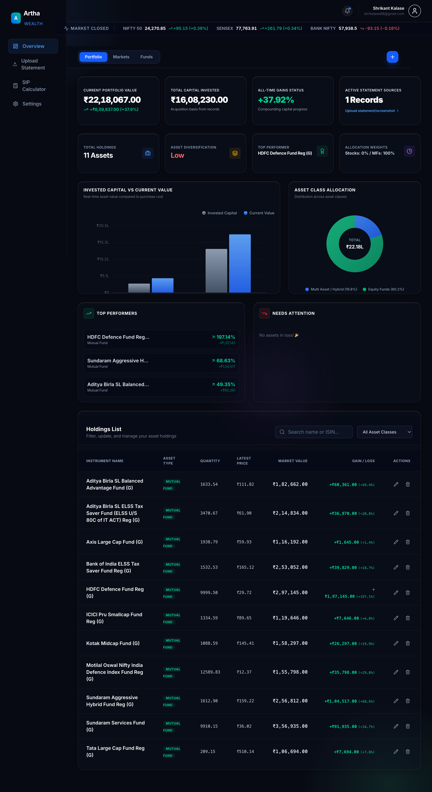

# Artha Wealth

Artha Wealth is a modern, AI-powered portfolio tracker that parses CAS statements and provides a premium overview of your mutual funds and stocks. Built with a beautiful glassmorphic UI, it helps you manage your wealth with precision.

## 🚀 Features
- **Intelligent CAS Parsing:** Upload your statements to extract accurate financial data.
- **Real-time Analytics:** Track mutual funds via API with live NAV and performance tracking.
- **Premium Glassmorphic UI:** A beautifully crafted, responsive dashboard designed for readability.
- **Secure Architecture:** Powered by Supabase Auth and database capabilities.

## 📸 Screenshots

### Desktop View - Dashboard

### Mobile View - Application

## 🛠️ Tech Stack
- **Frontend:** Next.js 14, React, Tailwind CSS, Tremor, Shadcn UI
- **Backend / Database:** Supabase (PostgreSQL, Auth, Storage)
- **Deployment:** Vercel

## ⚙️ Local Development
1. Clone the repository
2. Run `npm install` inside the `frontend` folder
3. Create a `.env.local` file with your Supabase credentials
4. Run `npm run dev` to start the development server
